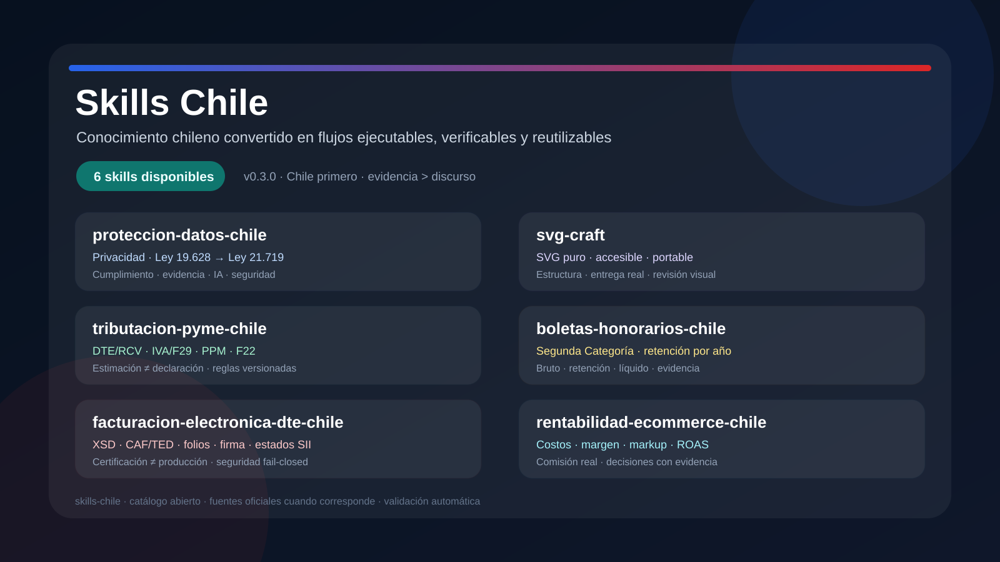
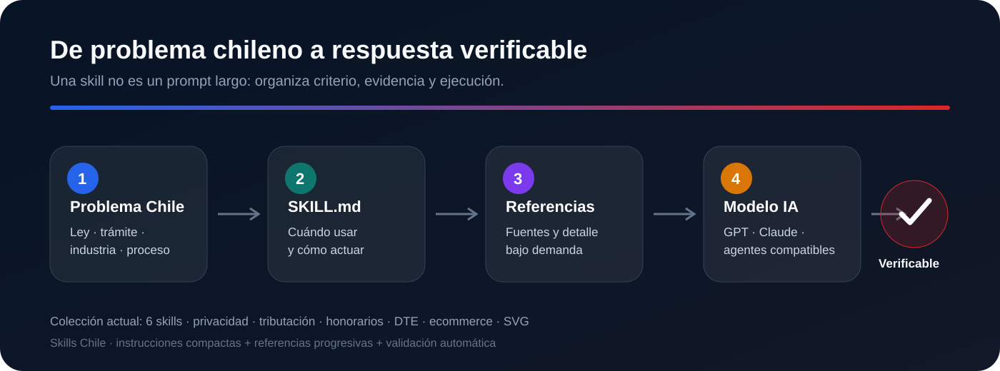

<p align="center">
  
</p>

<h1 align="center">Skills Chile 🇨🇱</h1>

<p align="center">
  <strong>Skills abiertas, reutilizables y enfocadas en problemas, normas y procesos reales de Chile.</strong>
</p>

<p align="center">
  <a href="CATALOG.md"></a>
  
  
  
</p>

---

## Una biblioteca de skills para Chile

**Skills Chile** parte con una idea concreta: tomar conocimiento chileno que normalmente está repartido entre leyes, documentación, procesos y experiencia práctica, y convertirlo en **skills que una IA pueda ejecutar de forma consistente**.

Este repositorio ya reúne **dos skills disponibles** y está diseñado para crecer mediante un catálogo, plantillas, contribuciones y validación automática.

<p align="center">
  
</p>

## Skills disponibles

<table>
<tr>
<td width="32%"><strong>proteccion-datos-chile</strong></td>
<td>Privacidad · Legal · GRC · Seguridad · IA</td>
</tr>
<tr>
<td><strong>Estado</strong></td>
<td>Disponible</td>
</tr>
<tr>
<td><strong>Última verificación</strong></td>
<td>14-AGO-2026</td>
</tr>
<tr>
<td><strong>Nueva ley</strong></td>
<td><strong>entra en vigencia el 01-DIC-2026</strong></td>
</tr>
</table>

La primera skill cubre la **Ley 19.628** y la transición a la **Ley 21.719**, que regula la protección y tratamiento de datos personales y crea la Agencia de Protección de Datos Personales.

> **Regla temporal esencial:** hasta el **30-NOV-2026** sigue siendo exigible el régimen vigente de la Ley 19.628; desde el **01-DIC-2026** entra en vigor el nuevo régimen de la Ley 21.719.

La fecha está verificada contra **LeyChile / Biblioteca del Congreso Nacional**. La Ley 21.719 fue publicada el **13-DIC-2024** y su texto tiene vigencia diferida al **01-DIC-2026**.

### Qué puede hacer

- analizar políticas y avisos de privacidad;
- ejecutar gap analysis de cumplimiento;
- revisar software, APIs, bases de datos y arquitectura;
- evaluar consentimiento y bases de licitud;
- revisar derechos de titulares y sus plazos;
- analizar incidentes y seguridad;
- detectar cuándo corresponde una DPIA;
- revisar encargados, cesiones y transferencias internacionales;
- analizar biometría, NNA, perfilamiento y decisiones automatizadas;
- separar **obligación legal**, **control recomendado** y **evidencia real**.

**Abrir la skill →** [`skills/proteccion-datos-chile/SKILL.md`](skills/proteccion-datos-chile/SKILL.md)

<details>
<summary><strong>¿Por qué no copiamos GDPR y listo?</strong></summary>

Porque una buena skill chilena parte de la norma chilena. GDPR, ISO, NIST y otros marcos pueden aportar controles, pero no deben convertirse automáticamente en obligaciones locales.

La primera skill incorpora guardrails específicos. Por ejemplo, no transforma automáticamente el deber chileno de reportar determinadas vulneraciones **sin dilaciones indebidas** en una regla general de 72 horas sólo porque ese número sea conocido en GDPR.

</details>

### `svg-craft`

Diseña y revisa SVG con foco en **accesibilidad, pureza vectorial y renderizado real en el destino**. Incluye guardrails para perfiles de GitHub, documentación y assets embebidos.

- exige `viewBox`, `role="img"`, `<title>` y `<desc>` cuando corresponde;
- evita raster embebido, assets externos, scripts y `<foreignObject>`;
- revisa IDs, clipping, contraste, tipografía y fallbacks;
- separa validación estructural, resolución de entrega y revisión visual;
- para perfiles GitHub prioriza URLs canónicas `raw.githubusercontent.com` y verificación en la página real.

**Abrir la skill →** [`skills/svg-craft/SKILL.md`](skills/svg-craft/SKILL.md)

---

## Instalar una skill en menos de 5 minutos

### ChatGPT

No necesitas programar. Puedes usarla dentro de un **Proyecto** o un **GPT personalizado**:

1. copia `SKILL.md` a las instrucciones;
2. agrega `references/` como archivos de conocimiento;
3. prueba una consulta real.

**Guía paso a paso →** [`docs/guides/agregar-skill-en-gpt.md`](docs/guides/agregar-skill-en-gpt.md)

### Claude

En **Claude Code** el formato es nativo. Para una skill de proyecto:

```bash
mkdir -p .claude/skills/proteccion-datos-chile
cp -R skills/proteccion-datos-chile/* .claude/skills/proteccion-datos-chile/
```

También puedes usarla como skill personal en `~/.claude/skills/` o cargarla como instrucciones/conocimiento de un Proyecto en claude.ai.

**Guía paso a paso →** [`docs/guides/agregar-skill-en-claude.md`](docs/guides/agregar-skill-en-claude.md)

---

## Diseño de las skills

Cada skill intenta seguir cuatro principios:

| Principio | Qué significa |
|---|---|
| **Chile primero** | fuentes, normativa y procesos locales antes de importar marcos extranjeros |
| **Divulgación progresiva** | `SKILL.md` compacto y referencias profundas sólo cuando hacen falta |
| **Evidencia > discurso** | no declarar cumplimiento sólo porque existe una política |
| **Verificable** | estructura, enlaces y SVG se validan automáticamente en CI |

La arquitectura sigue el patrón:

```text
PROBLEMA → ALCANCE → REGLA → APLICABILIDAD → EVIDENCIA → RIESGO → ACCIÓN → VERIFICACIÓN
```

---

## Estructura

```text
skills-chile/
├─ assets/
│  ├─ skills-chile-hero.svg
│  └─ skill-system.svg
├─ skills/
│  ├─ proteccion-datos-chile/
│  │  ├─ SKILL.md
│  │  └─ references/
│  │     ├─ marco-y-vigencia.md
│  │     ├─ obligaciones-y-derechos.md
│  │     ├─ seguridad-incidentes-dpia-ia.md
│  │     └─ terceros-transferencias-sanciones.md
│  └─ svg-craft/
│     └─ SKILL.md
├─ templates/
│  └─ SKILL_TEMPLATE.md
├─ docs/
│  ├─ QUALITY_STANDARD.md
│  ├─ ROADMAP.md
│  └─ guides/
├─ scripts/
│  └─ validate_repo.py
├─ .github/
│  ├─ ISSUE_TEMPLATE/
│  ├─ PULL_REQUEST_TEMPLATE.md
│  └─ workflows/validate.yml
├─ CATALOG.md
├─ CONTRIBUTING.md
├─ SECURITY.md
└─ LICENSE
```

---

## Quiero agregar una skill chilena

1. copia [`templates/SKILL_TEMPLATE.md`](templates/SKILL_TEMPLATE.md);
2. crea `skills/<nombre>/SKILL.md`;
3. agrega referencias si son necesarias;
4. ejecuta:

```bash
python scripts/validate_repo.py
```

5. abre un pull request siguiendo [`CONTRIBUTING.md`](CONTRIBUTING.md).

Si sólo tienes la idea, abre una **solicitud de nueva skill** usando el template de Issues.

---

## Qué viene después

La primera skill es sólo el inicio. Algunas áreas naturales para crecer son:

- SII y tributación chilena;
- ChileCompra / Mercado Público;
- protección al consumidor;
- ciberseguridad y cumplimiento;
- ecommerce en Chile;
- gobierno digital y sector público;
- salud, educación y datos sensibles;
- laboral y gestión de personas;
- procesos para pymes y emprendimientos.

Ver [`docs/ROADMAP.md`](docs/ROADMAP.md).

---

## Fuentes de la primera skill

Las fuentes normativas prioritarias son oficiales:

- Biblioteca del Congreso Nacional / LeyChile;
- Diario Oficial;
- Agencia de Protección de Datos Personales, cuando sus actos sean vigentes;
- reguladores sectoriales cuando corresponda.

El diseño operativo también toma ideas de proyectos GRC abiertos y de las buenas prácticas modernas de Agent Skills, pero **una buena práctica técnica nunca se presenta como obligación legal chilena si la ley no la establece**.

---

## Aviso

Este repositorio entrega herramientas de análisis y cumplimiento, no reemplaza asesoría jurídica profesional para litigios, sanciones, operaciones de alto impacto o interpretaciones dudosas.

## Licencia

MIT. Revisa [`LICENSE`](LICENSE).

---

<p align="center"><strong>Hecho para convertir conocimiento chileno en herramientas que realmente se puedan usar.</strong></p>
